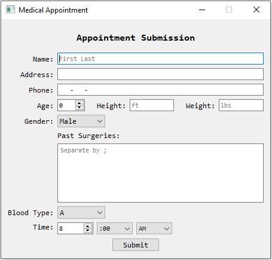
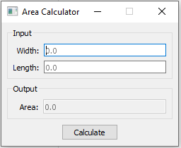
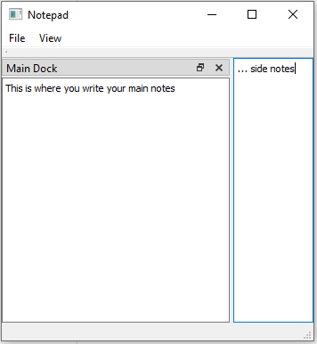
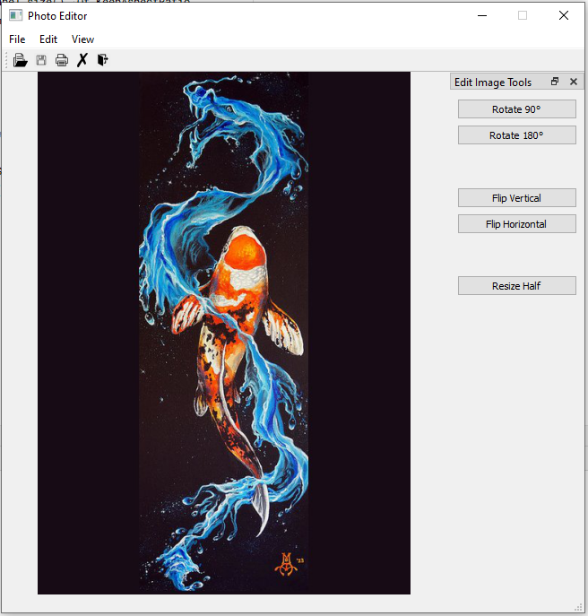
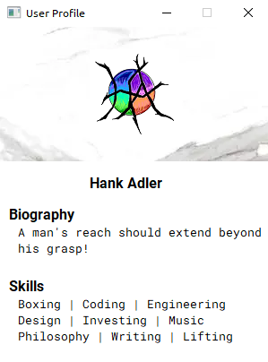

# PyQt Samples

Various GUI samples


## Table of Contents

- [Screenshots](#screenshots)
- [Setup](#setup)
- [Example](#example)
- [License](#license)


## Screenshots

### Appointment



### Area Calculator



### Notepad



### Photo Editor



### Spin Wheel


### User Profile




## Setup

```bash
pipenv install
```


## Example

```bash
pipenv shell
python spinwheel.py
```


## License
[MIT](LICENSE)
