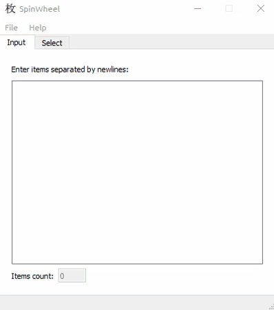

# PyQt Samples

Various GUI samples


## Table of Contents

- [Screenshots](#screenshots)
- [Setup](#setup)
- [Example](#example)
- [License](#license)


## Screenshots

### Appointment


### Area Calculator


### Notepad


### Photo Editor


### Spin Wheel



### User Profile


## Setup

```bash
pipenv install
```


## Example

```bash
pipenv shell
python spinwheel.py
```


## License
[MIT](LICENSE)
